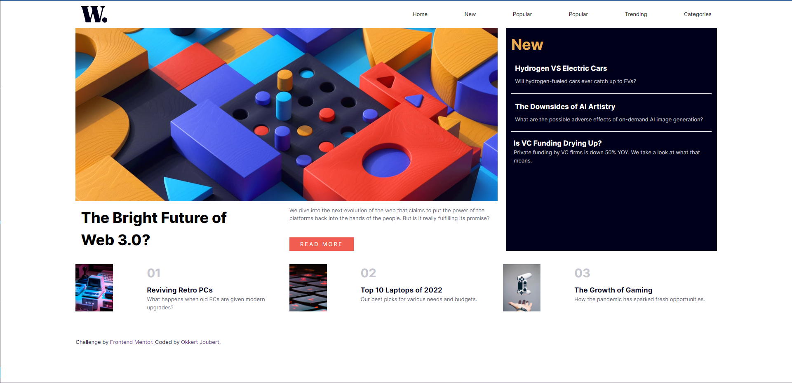

# Frontend Mentor - News homepage solution

This is a solution to the [News homepage challenge on Frontend Mentor](https://www.frontendmentor.io/challenges/news-homepage-H6SWTa1MFl). Frontend Mentor challenges help you improve your coding skills by building realistic projects. 

## Table of contents

- [Overview](#overview)
  - [The challenge](#the-challenge)
  - [Screenshot](#screenshot)
  - [Links](#links)
- [My process](#my-process)
  - [Built with](#built-with)
  - [What I learned](#what-i-learned)
  - [Continued development](#continued-development)
  - [Useful resources](#useful-resources)
- [Author](#author)

## Overview

### The challenge

Users should be able to:

- View the optimal layout for the interface depending on their device's screen size
- See hover and focus states for all interactive elements on the page

### Screenshot




### Links

- Solution URL: [Add solution URL here](https://your-solution-url.com)
- Live Site URL: [Add live site URL here](https://your-live-site-url.com)

## My process

### Built with

- Semantic HTML5 markup
- CSS custom properties
- JavaScript
- SVG
- CSS Grid
- Mobile-first workflow

### What I learned

Created my very first svg in this project and I'm very proud of my accomplishment. 

```html
<svg class="hamburger-bar" viewBox="0 0 100 100" width="25">
        <rect class="line top"
            width="80" height="10"
            x="10" y="20" rx="5">
        </rect>
        <rect class="line middle"
            width="80" height="10"
            x="10" y="45" rx="5">
        </rect>
        <rect class="line bottom"
            width="80" height="10"
            x="10" y="70" rx="5">
        </rect>
      </svg>
```

### Continued development

Building out the hamburger menu was interesting and challenging future development in this section is required to get it working more smoothly.

### Useful resources

- [Youtube - Kevin Powell](https://www.youtube.com/watch?v=R00QiudbD4Y&t=798s) - Thanks for the help with the hamburger menu.

## Author

- Frontend Mentor - [@Okkie14](https://www.frontendmentor.io/profile/Okkie14)